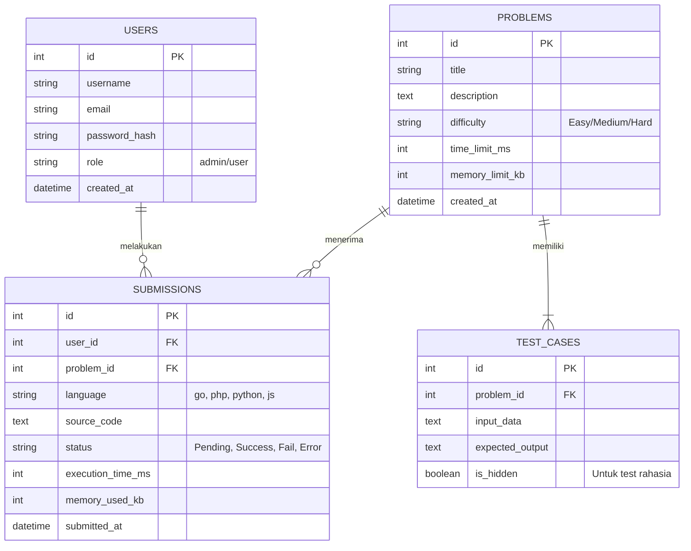

# Entity Relationship Diagram (ERD)
## LeetCode Clone Lokal

### Penjelasan Tabel Utama (MySQL)
1. **USERS**: Menyimpan data autentikasi pengguna. Memiliki kolom `role` untuk membedakan **Admin** (pemilik yang bisa membuat/menghapus soal) dan **User** (peserta biasa).
2. **PROBLEMS**: Bank soal. Menyimpan detail soal, tingkat kesulitan, serta batasan waktu (*time limit*) dan memori yang diizinkan saat eksekusi di Docker.
3. **TEST_CASES**: Menyimpan *input* dan *expected output* (harapan hasil). Terdapat kolom `is_hidden` agar kita bisa membuat *test case* yang disembunyikan dari pengguna untuk mencegah mereka melakukan kecurangan (misal *hardcode* jawaban).
4. **SUBMISSIONS**: Tabel paling krusial. Menyimpan setiap kode yang disubmit, bahasa yang dipakai, status kelulusan *test case*, serta seberapa cepat kode tersebut berjalan.

*(Catatan: Redis tidak dimasukkan ke dalam ERD karena Redis bersifat penyimpanan sementara / cache / queue, bukan penyimpanan relasional permanen).*
